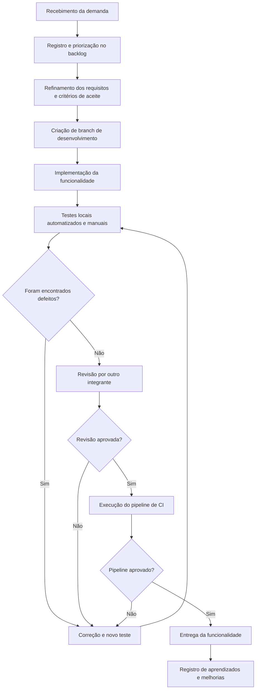

# Aula 14 - Qualidade de Processo

Projeto: LocalEats  
Sistema: <https://local-eats-unisenac.vercel.app/>  
Integrante(s): Robinson Abraham

## 1. Mapeamento do Processo Atual

O processo atual considera um fluxo simples de desenvolvimento, validação e entrega para funcionalidades do LocalEats. A qualidade é inserida desde o refinamento da demanda até a validação final com testes e revisão.

## 2. Entradas, Atividades e Saídas

| Etapa | Entrada | Atividade | Saída |
|---|---|---|---|
| Recebimento da demanda | Necessidade do usuário ou proposta da equipe | Registrar a demanda e entender o objetivo da funcionalidade | Item inicial no backlog |
| Priorização e refinamento | Demanda registrada | Definir escopo, regras de negócio e critérios de aceite | Requisito pronto para desenvolvimento |
| Desenvolvimento | Requisito refinado e branch criada | Implementar a solução no código | Código da funcionalidade |
| Testes locais | Código implementado | Executar testes automatizados e testes manuais básicos | Evidência de funcionamento ou lista de defeitos |
| Correção de defeitos | Falhas encontradas nos testes ou revisão | Ajustar código e repetir a validação | Código corrigido |
| Revisão | Código e testes aprovados localmente | Conferir clareza, aderência ao requisito e possíveis regressões | Aprovação ou solicitação de ajuste |
| Integração contínua | Código revisado no repositório | Executar pipeline automatizado no GitHub Actions | Resultado do pipeline |
| Entrega | Pipeline aprovado | Disponibilizar a alteração na branch principal ou versão final | Funcionalidade entregue |

## 3. Reflexão sobre o Processo

O processo da equipe está parcialmente definido: há uma sequência lógica entre demanda, desenvolvimento, testes, correções e entrega, mas algumas etapas ainda dependem de disciplina manual.

Todos os integrantes devem seguir o mesmo fluxo, especialmente o uso de backlog, branch, teste local, revisão e pipeline. Quando cada pessoa trabalha de uma forma diferente, aumentam as chances de retrabalho e defeitos recorrentes.

A qualidade é verificada principalmente no refinamento dos critérios de aceite, nos testes locais, na revisão e na execução do GitHub Actions. Essas etapas reduzem o risco de uma funcionalidade ser entregue sem validação suficiente.

As principais melhorias seriam padronizar Definition of Ready e Definition of Done, registrar defeitos em issues, manter rastreabilidade entre requisito, teste e código, e acompanhar indicadores simples de qualidade.

A qualidade do processo impacta diretamente a qualidade do produto final, porque um fluxo claro evita entregas improvisadas, facilita a comunicação, antecipa problemas e torna as correções mais rápidas e controladas.
